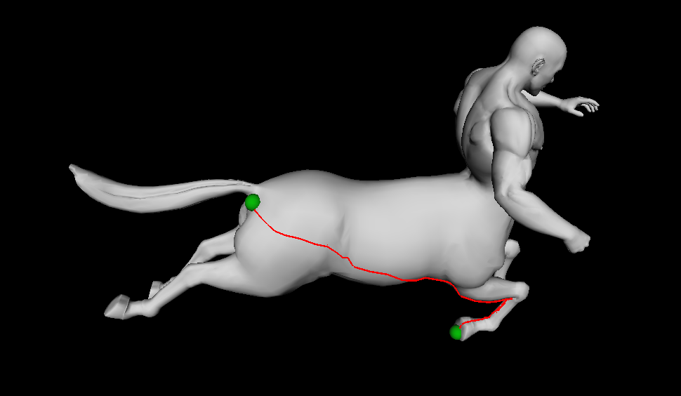
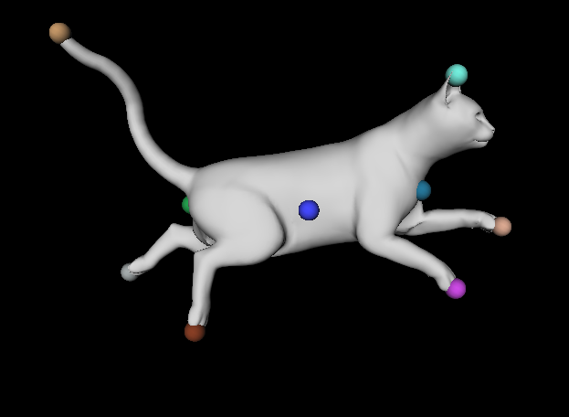
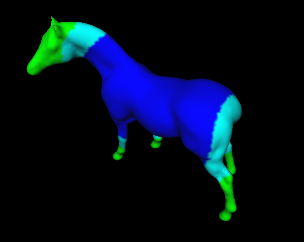
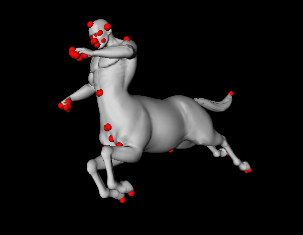
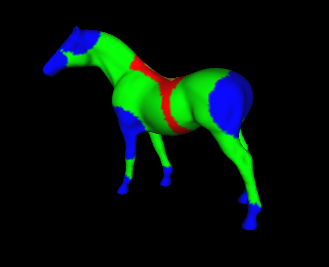

# digital-geometry-processing
Assignments of CENG789 Master's course on Digital Geometry Processing

The base code can be found in https://user.ceng.metu.edu.tr/~ys/ceng789-dgp/. The code can be executed by running .sln file. I have used
Coin3D Open Inventor for 3D SDK which is built on top of OpenGL.

## Assignment-1
In this assignment, I have implemented following three parts:

- ### Geodesics on Meshes by applying Dijkstra algorithm

 
 

- ### Farthest Point Sampling algorithm

  For the meshes that have huge vertex size, the computation of AGD function by calculating the N-size geodesic distance 
  array for each vertex was really costly. It was a nice and efficient solution to take 100 Farthest Point samples to 
  find the other's geodesic distances. I have observed that Farthest Point Samples was crucial to have an accurate 
  and average results without any extra cost. 

  After applying this, also visualizing the resulting AGD function for the horse 
  input was interesting for me. At first, I got a few more maxima points but I have solved it by averaging over local 1-rings.
  I got a closer and cool image similar to the figure in the paper.On the other hand, for man and gorilla inputs, 
  the output was more remarkable (especially in the details like finger tips , eyes or nose etc.)

  I have tried with different numbers of farthest point samples to calculate agd; however, 
  I couldn't realize big differences between 100 or 200 points. The visualization was almost same.
  
   

- ### Symmetry-Invariant Sampling 

  I have implemented Section 4 of the paper titled Mobius Transformations For Global Intrinsic Symmetry Analysis

  AGD-function : 
  
  
  
  AGD local-maxima points : 
  
  
  
  MGD-function : 
  
  

  I have put effort to extract local maximas of a subset S2 based on Minimal Geodesic Distance(MGD) 
  from the set of S1 which consists of the local maximas of AGD function. The resulting set S2 was also a
  symmetry-invariant function. This has enlightened me to get an idea of how closely related geodesic distance concept and 
  selecting a set of critical points of a mesh are.
